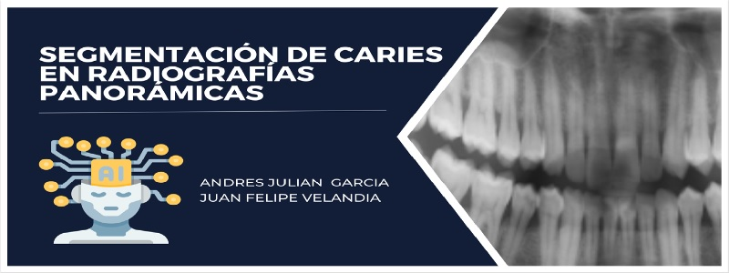

# Segmentación de Caries en Radiografías Panorámicas 

 

**Autores**: 
Andres Julian Garcia Rueda, Juan Felipe Velandia Naranjo

**Objetivo**: 
Haciendo uso de segmentacion y UNET, buscamos en base al analisis de readiografias y sus mascaras, detectar si la presencia de caries.

**Dataset**: 
*Link de descarga*: https://www.kaggle.com/datasets/thunderpede/panoramic-dental-dataset 
El dataset es una coleccion de imagenes y sus correspondientes mascaras de segmentacion de caries dentales. 
Los datos fueron obtenidos de un repositorio open source en github: https://github.com/Zzz512/MLUA.

**Modelos**: 
UNET

**Código**: https://colab.research.google.com/drive/1aVgEIwwyVbHfaq_-LhfYjT-lC80pKQKx?usp=sharing 
**Video**: placeholder 
**Repositorio**: placeholder 
